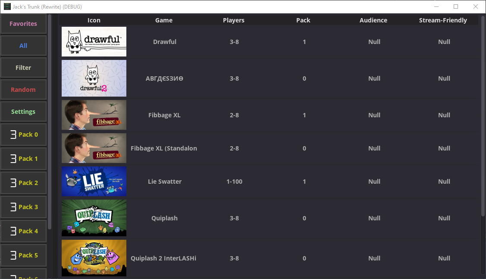

# Jack's Trunk (Rewrite)

Jack's Trunk is an launcher used to quickly access any specific Jackbox Game. It has support for Jackbox 1 - 8 along with the Standalone games outside of the Jackbox Collections.

## What's new?

Compared to the original Jack's Trunk[^1], the rewritten version has support for: 

- Controller Input
- Higher Resolution Screens
- Dark Mode
- Better Language Support
- A web server to allow remote players to pick the game and launch it on your system

## How to use?

:clock2: Coming Soon.

## Status

It is currently in development and not ready for public usage.

- [x] Settings Saving & Loading
- [ ] Populate full game list from database
- [ ] Get new patching method working
- [ ] Bug testing

## How to build?

You will need 
- [Godot](https://godotengine.org/) (Originally built with 3.4-206ba70f4)
- the [godot-sqlite addone](https://github.com/2shady4u/godot-sqlite) made by @2shady4u placed in /addons/
- the [toast addon](https://github.com/rares45/godot-toasts) made by @rares45 also placed in /addons/
- copy of [OpenSans-Regular.ttf and OpenSans-Bold.ttf](https://fonts.google.com/specimen/Open+Sans) placed in /

The addons and Font Family were not included due to their licensing conditions.

Once gathered, open projoct.godot with Godot and Project => Export to build.

*NOTE: This utility requires patching the Jackbox Games to allow direct launch of the minigames, these patches are not included and instead must be user-generated and placed in /patches/
(No information will be provided for how to create these patches.)

## Screenshots

## Credits

Dax [@DebugDax](https://twitter.com/debugdax)

[^1]: The original Jack's Trunk extended to version 1.1, was made in C#, and did not have a resizable interface
